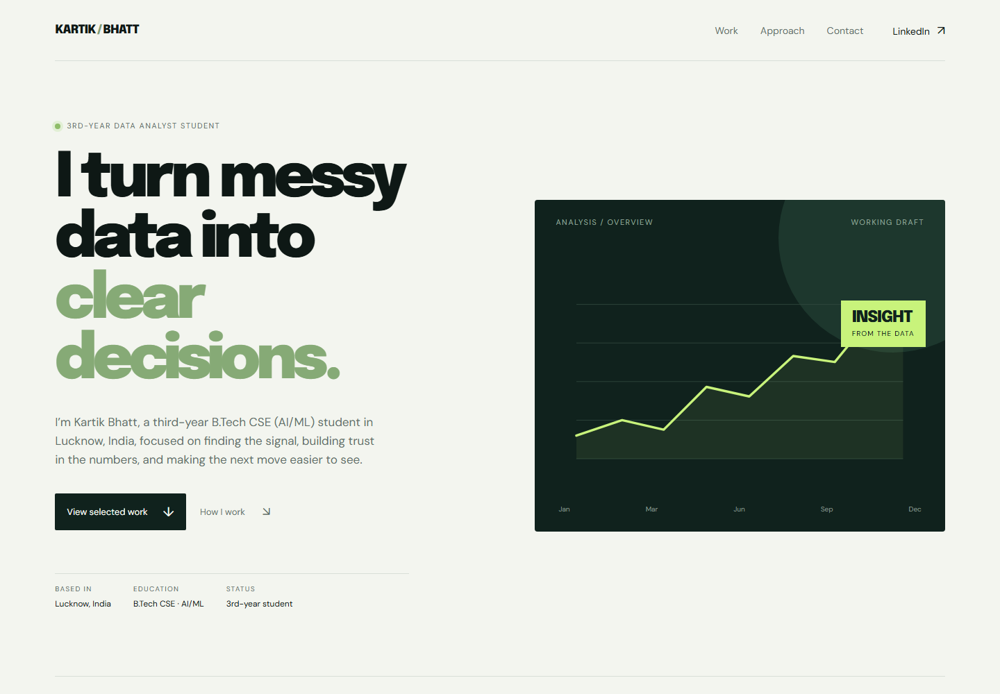
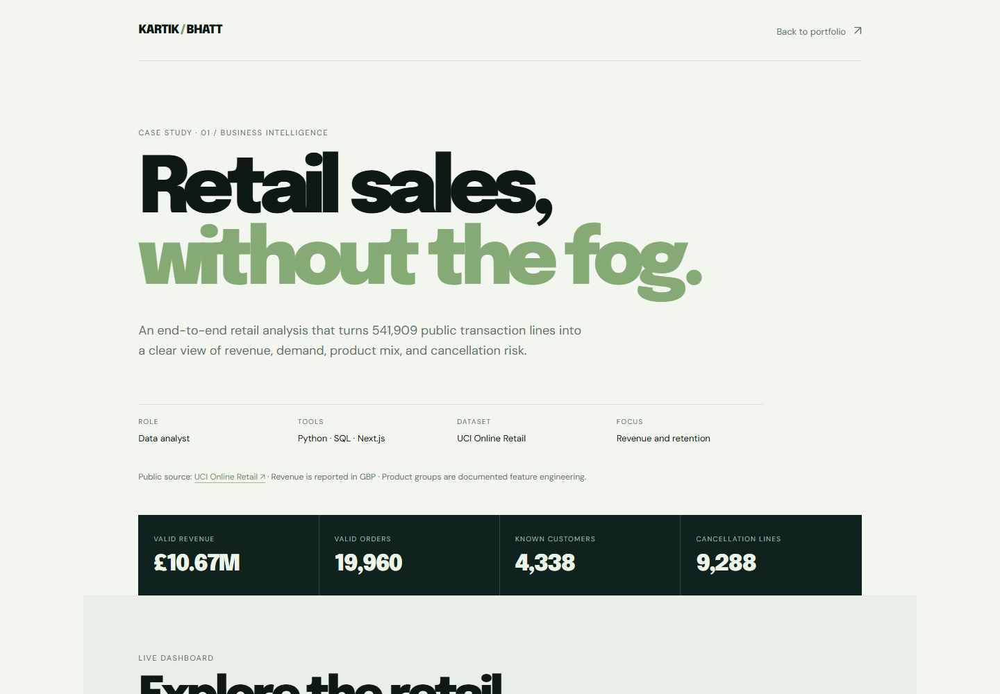
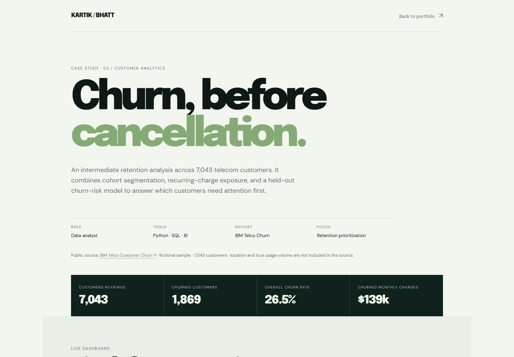
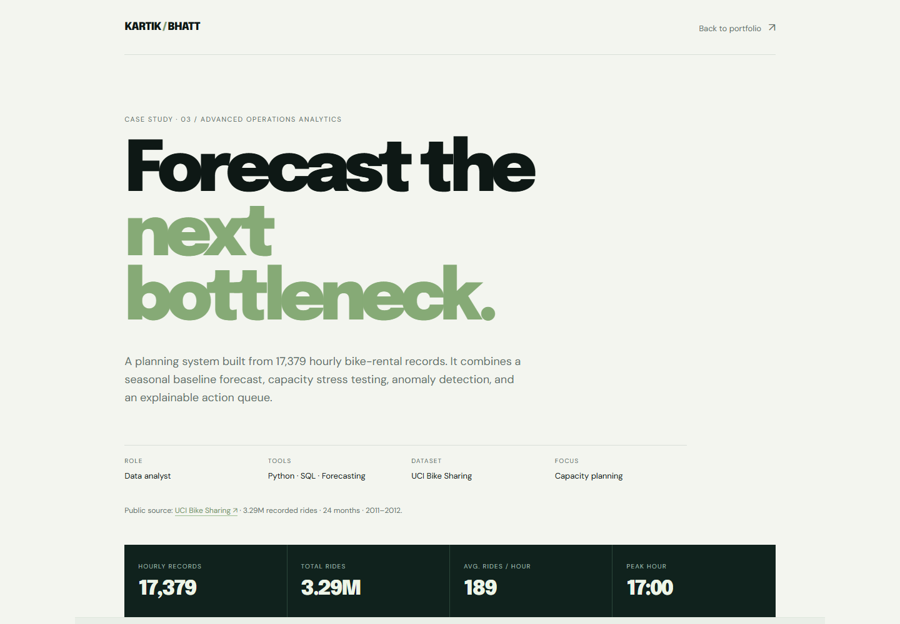

# Kartik Bhatt | Data Analyst Portfolio

Third-year B.Tech Computer Science Engineering (AI/ML) student based in Lucknow, India. I build practical analytics projects that connect messy data to clear business decisions.

[View the live portfolio](https://kartik-data-analyst-portfolio.vercel.app/) · [LinkedIn](https://www.linkedin.com/in/kartik-bhatt-33bbb02b7/) · [Kaggle](https://www.kaggle.com/kartikbhatt5533)

## What this repository demonstrates

- Data cleaning, quality checks, and exploratory analysis with Python and pandas
- SQL KPI design, segmentation, and business-question-driven analysis
- Classification, model evaluation, forecasting baselines, and sensitivity analysis
- Interactive dashboard storytelling for business and operations audiences
- Reproducible analysis scripts, documented assumptions, limitations, and recommendations

## Case studies

| Project | Business question | Methods and evidence |
| --- | --- | --- |
| [Online Retail Revenue & Returns](./projects/superstore-sales-dashboard) | Where is demand coming from, and where is revenue leaking through cancellations? | UCI Online Retail data, Python, SQL, data-quality workflow, market/product analysis |
| [Customer Churn Analysis](./projects/customer-churn-analysis) | Which customers should a retention team prioritize, and why? | IBM Telco sample, cohort segmentation, logistic-regression baseline, churn scores, retention queue |
| [Bike Sharing Capacity Planning](./projects/bike-sharing-operations) | When will demand exceed available capacity, and what action should operations take? | Hourly demand, model comparison, holdout MAPE, anomaly detection, capacity stress testing |

Each project includes its own README, analysis script, SQL queries, generated outputs, and interview guide where applicable.

## Visual preview

<table>
  <tr>
    <td></td>
    <td></td>
  </tr>
  <tr>
    <td></td>
    <td></td>
  </tr>
</table>

## Run the portfolio locally

Requirements: Node.js 18+ and Python 3.10+.

```bash
npm install
npm run dev
```

Open [http://localhost:3000](http://localhost:3000).

## Run an analysis

Each case study can be regenerated independently:

```bash
cd projects/superstore-sales-dashboard
python analysis.py

cd ../customer-churn-analysis
python analysis.py

cd ../bike-sharing-operations
python analysis.py
```

The scripts validate the input data and write findings, metrics, and dashboard-ready outputs into each project's `outputs` folder.

## About me

I am strengthening my foundation in SQL, Python, statistics, Excel, Power BI, and business intelligence through my B.Tech CSE (AI/ML) degree. I am interested in entry-level data analyst and business intelligence opportunities where I can turn analysis into measurable action.

- Location: Lucknow, India
- [LinkedIn](https://www.linkedin.com/in/kartik-bhatt-33bbb02b7/)
- [GitHub](https://github.com/kartik-bhatt767)
- [Kaggle](https://www.kaggle.com/kartikbhatt5533)
